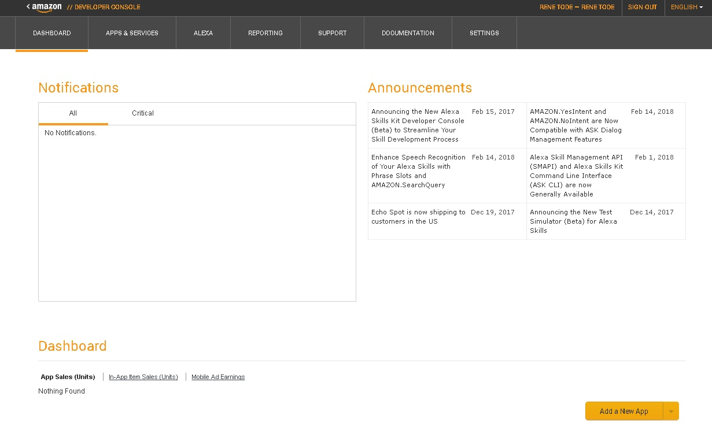
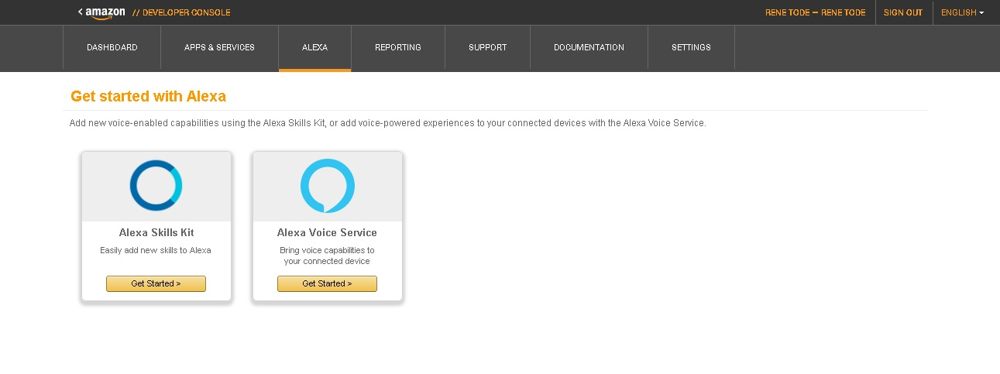
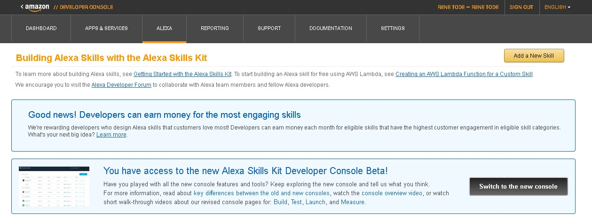
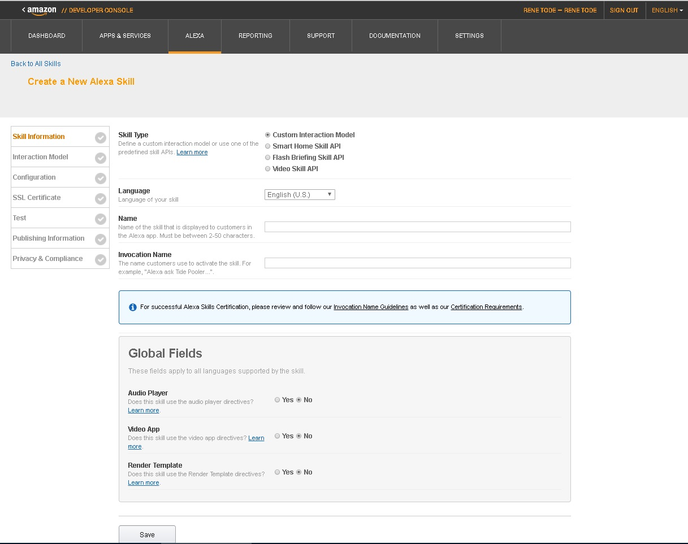
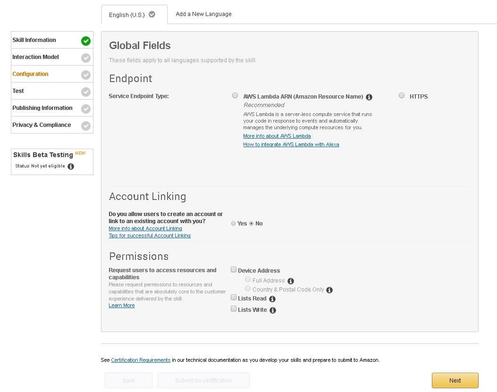
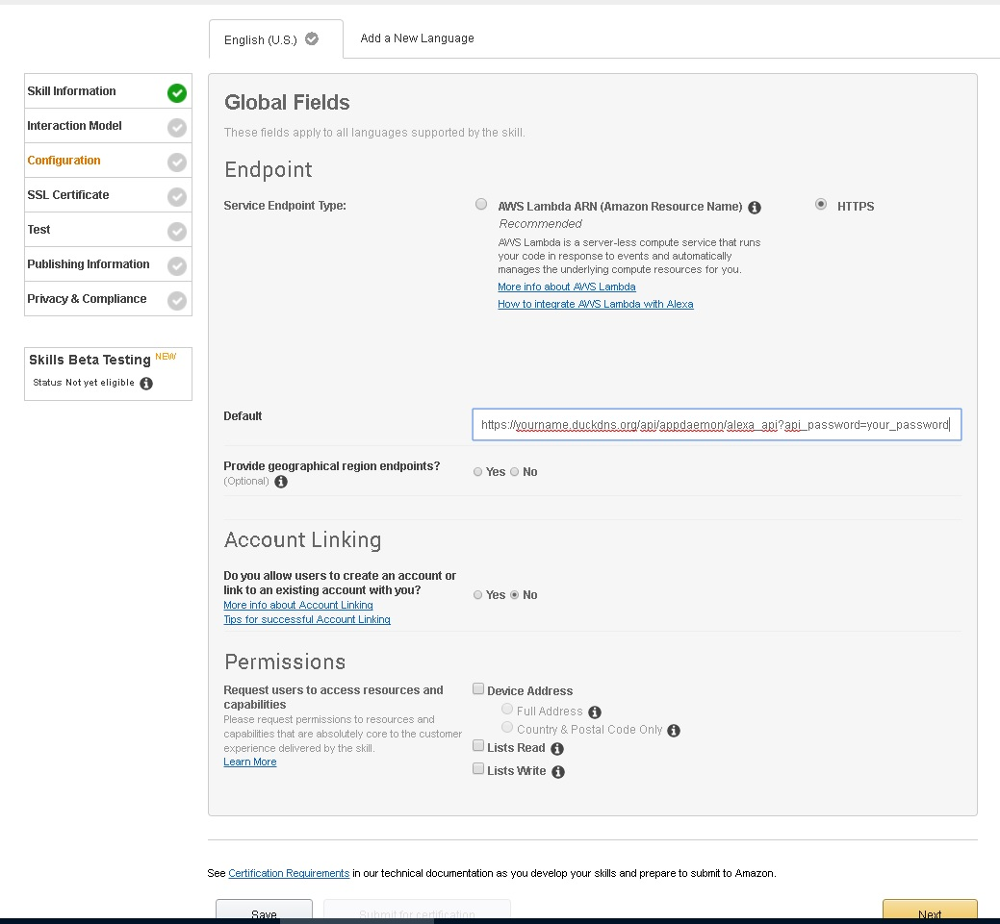
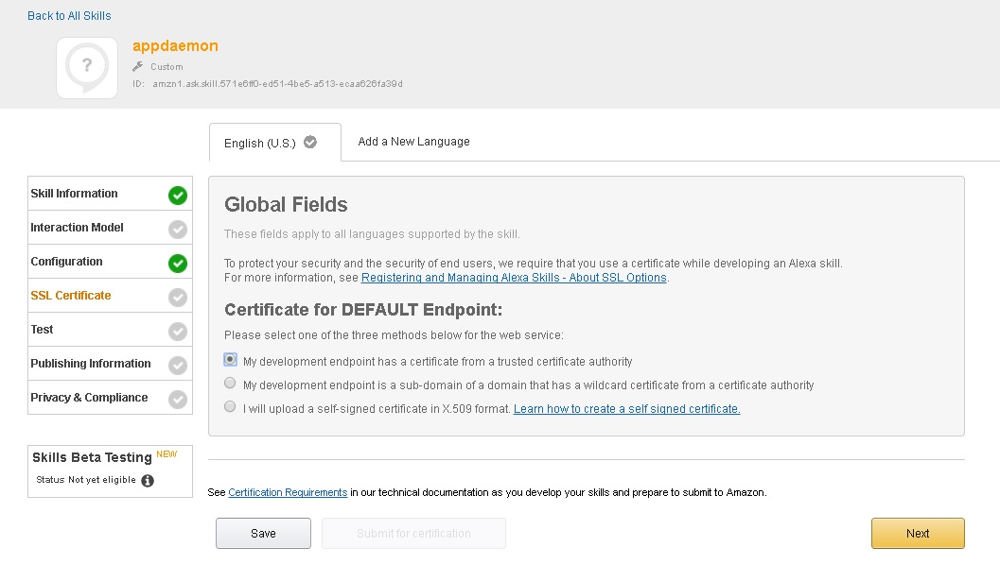
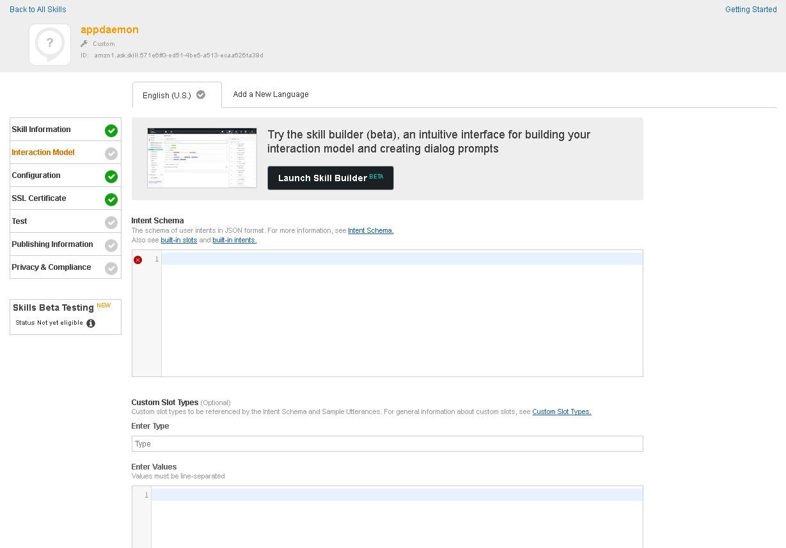
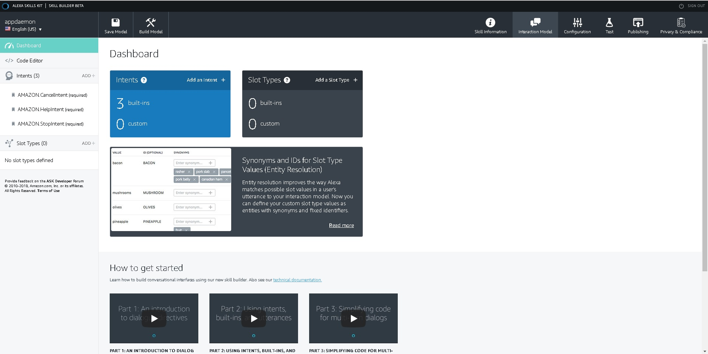
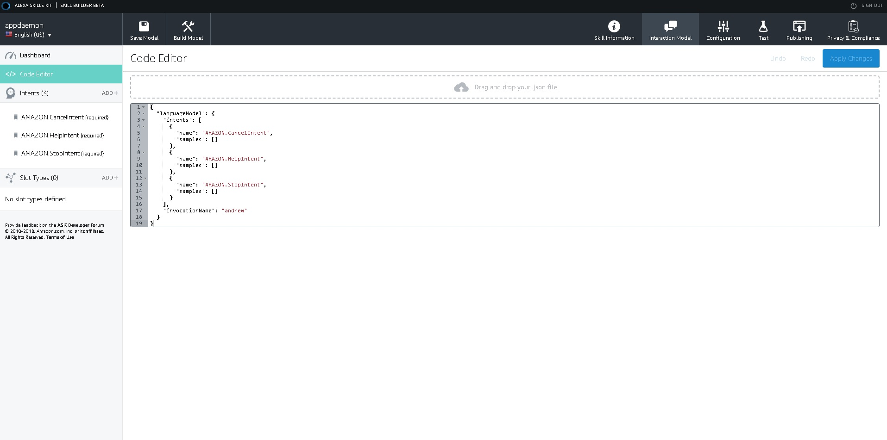

1) Go to developer.amazon.com and login.

2) chose developer console at the top right

3) chose Alexa

4) chose get started for alexa skills kit

5) chose add new skill at the top right

6) give your skill a name and an invocation name (the name you say to alexa) and chose a language and chose save
for demo i use appdaemon, Andrew and english
7) chose configuration in the menu on the left

8) chose endpoint https and provide the url that we created to reach appdaemon like: https://yourname.duckdns.org/api/appdaemon/alexa_api?api_password=your_password
and chose save

9)chose ssl certificate in the menu
chose "My development endpoint has a certificate from a trusted certificate authority"
and save

10) chose interaction model in the left menu

11) chose the big black button "lauch skill builder beta"

12) now we are actually ready to start creating the skill intents. you can get back to the configuration by chosing configuration on the top right.
if you want to add your own intents then you can start by adding an intent and creating an app for that intent. if you want to add existing intents then follow the next steps. dont forget the basic intents i have implemented in the app a yesIntent, changing the StopIntent, and HelpIntent, but they are optional.
13) chose code editor in the menu left

we now have a basic skill.
to this we can add intents and slottypes as much as we like.
the skill in total looks like:
```
{
 "languageModel": {"intents": [], "types":[],  "invocationName": "Andrew"},
 "prompts": [],
 "dialog": {"intents": []}
}
```
between the brackets [] we can add our stuff as commaseperated lists.

an example from a "type" looks like
```
{"name": "mylocations", "values": 
          [
          {"id": null, "name": {"value": "livingroom ", "synonyms": []}},
          {"id": null, "name": {"value": "bedroom", "synonyms": []}},
          {"id": null, "name": {"value": "pond", "synonyms": []}},
          {"id": null, "name": {"value": "aquarium", "synonyms": []}}
          ]
 }
 ```
 
an example from an intent looks like:
```
{"name": "temperatureStateIntent",
    "samples": 
          [
          "what is the temperature in {location}",
          "how warm is it in {location}",
          "what temperature has {location}",
          "tell me the temperature",
          "what is the temperature"
          ],
    "slots": 
          [
          {"name": "location",
           "type": "mylocations",
           "samples": 
                [
                "{location}"
                ]
          }
          ]
}
```

