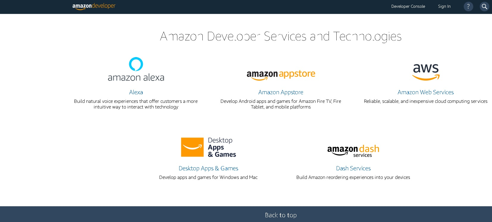
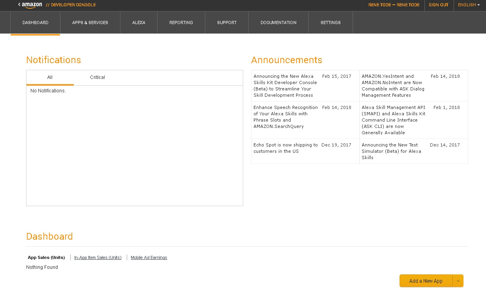
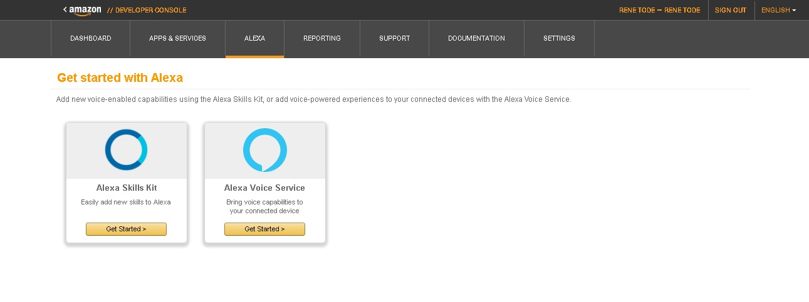
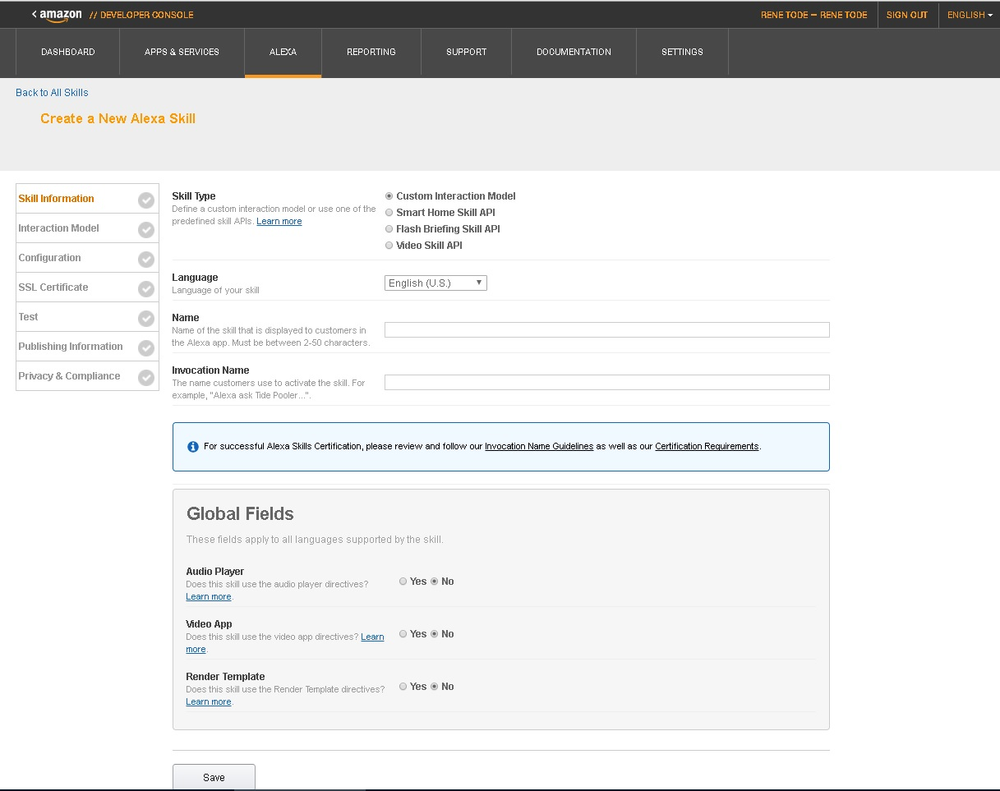
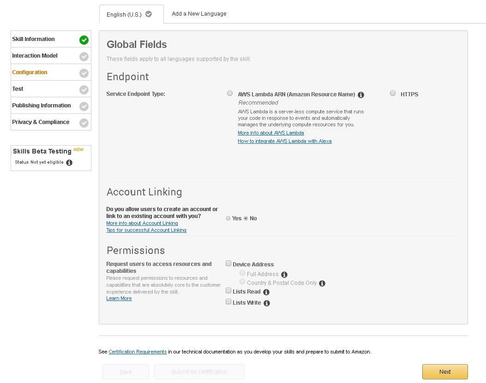
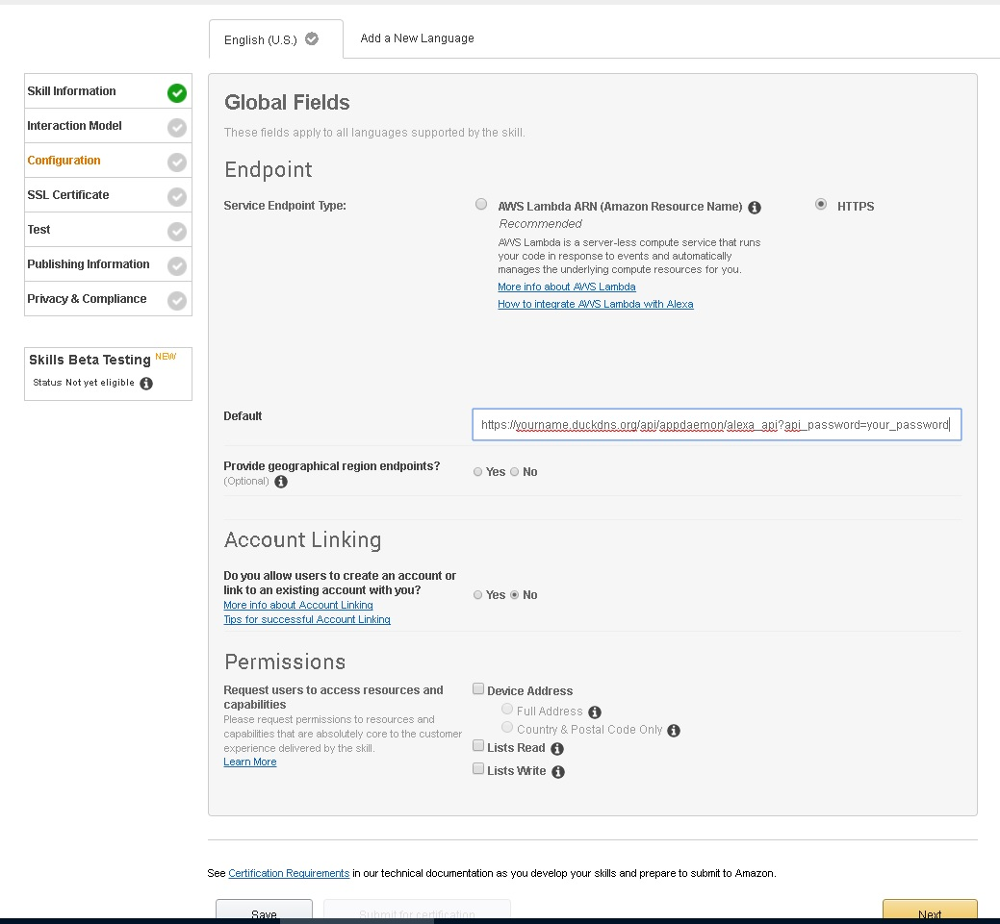
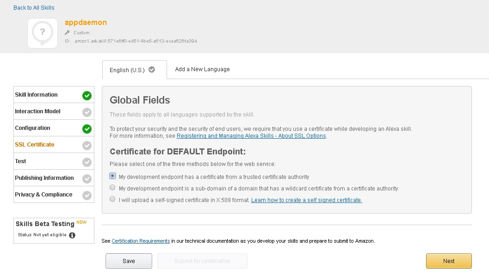
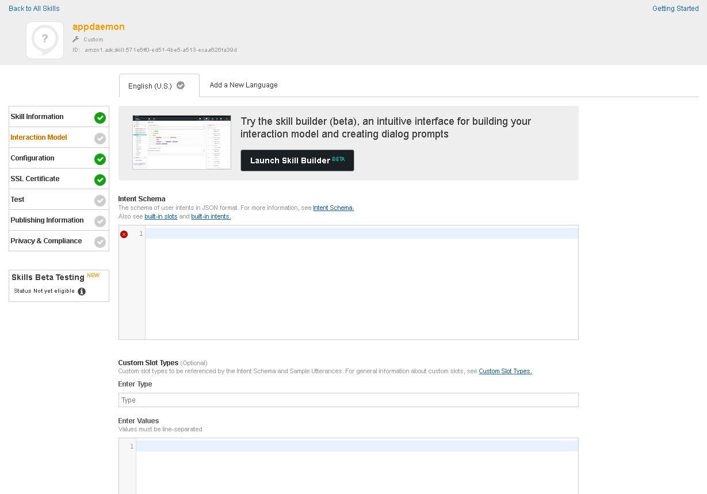
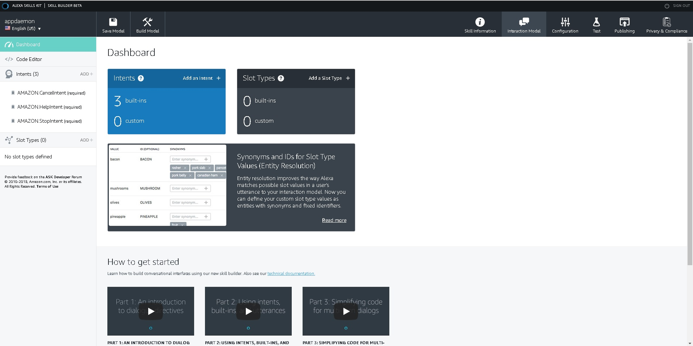
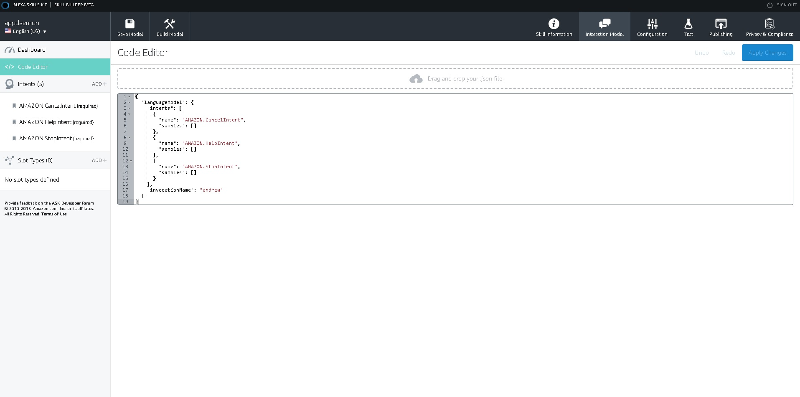

# Tutorial

This tutorial has 3 parts
1) The configuration from Appdaemon
2) the configuration from NGINX as server before Appdaemon and Homeassistant
3) The configuration from Amazon developer (the skill)
4) Adding intents to the skill
5) Addings Intent apps to Appdaemon

to use and configure this app i expect people to have the following:
1) Appdaemon working and configured for normal use
2) Letsencrypt installed
3) the capability to find and edit files in a linux environment
4) basic understanding from lists [] and dictionairies {} 

Allthough it is probably also possible to use this with Hassio, i dont know how configuring on that platform would go.
for that reason i dont support this app on that platform.

## Part 1 configuring Appdaemon

This is the most simple part from the total.  
All we have to do is edit the appdaemon.yaml  
In the section appdaemon we have to add 2 lines:  
```
  api_key: Your_password
  api_port: any_port
```
Remember that the api port needs to be a different port then your dashboard port and it must be a free usable port.
if you dont have any idea i suggest using 6061 or 5051

## Part 2 configuring NGINX

if you dont have NGINX installed before you need to install NGINX. (sudo apt-get install nginx)  
this part can only work when you dont have ssl installed in home assistant.  
most people only have 1 outside IP (the router) and so there is only 1 https port available.  
to connect to Alexa we need https so we need a way to split up that port.  
the way to do that is like this:  
https://yourname.duckdns.org goes to http://internalIP:8123 (home assistant)  
https://yourname.duckdns.org/api/appdaemon/*.* goes to http://internalIP:yourAPIport/api/appdaemon  
i configured it this way (probably not the best or cleanest way but it works)  
after installing NGINX  
find the file /etc/nginx/sites-enabled/default and edit it.  
my configuration is like this:  
```
server {
        listen 80;
        server_name *.duckdns.org;
        return 301 https://$server_name$request_uri;
}
server {
        listen 443 ssl;
        server_name YOURNAME.duckdns.org;
        ssl on;  
        ssl_certificate /etc/letsencrypt/live/YOURNAME.duckdns.org/fullchain.pem; # /etc/nginx/cert.crt;
        ssl_certificate_key /etc/letsencrypt/live/YOURNAME.duckdns.org/privkey.pem; # /etc/nginx/cert.key; 
        ssl_session_cache shared:SSL:10m;
        ssl_protocols TLSv1.1 TLSv1.2;
        ssl_ciphers 'EECDH+AESGCM:EDH+AESGCM:AES256+EECDH:AES256+EDH';
        ssl_prefer_server_ciphers on;
        proxy_buffering off;

        location / {
            proxy_pass http://YOUR_LOCAL_IP:8123;
            proxy_http_version 1.1;
            proxy_set_header Upgrade $http_upgrade;
            proxy_set_header Connection "upgrade";
        }

        location /api/appdaemon/ {
            allow all;
            proxy_pass http://YOUR_LOCAL_IP:YOUR_API_PORT;
            proxy_set_header Host $host;
            proxy_redirect http:// http://;
        }

}
```
Remember if you also want the dashboard reached outside your network, you must also add a configuration part for that here.  
I dont use dashboards outside my own network so thats why i dont have that included.  
After you have set this up Alexa should be able to reach your appdaemon.  

## Part 3 the skill

1) Go to developer.amazon.com and login.


2) chose developer console at the top right


3) chose Alexa


4) chose get started for alexa skills kit


5) chose add new skill at the top right


6) give your skill a name and an invocation name (the name you say to alexa) and chose a language and chose save
for demo i use appdaemon, Andrew and english

7) chose configuration in the menu on the left


8) chose endpoint https and provide the url that we created to reach appdaemon like: https://yourname.duckdns.org/api/appdaemon/alexa_api?api_password=your_password
and chose save


9)chose ssl certificate in the menu
chose "My development endpoint has a certificate from a trusted certificate authority"
and save


10) chose interaction model in the left menu


11) chose the big black button "lauch skill builder beta"


12) now we are actually ready to start creating the skill intents. you can get back to the configuration by chosing configuration on the top right.
if you want to add your own intents then you can start by adding an intent and creating an app for that intent. if you want to add existing intents then follow the next steps. dont forget the basic intents i have implemented in the app a yesIntent, changing the StopIntent, and HelpIntent, but they are optional.

13) chose code editor in the menu left



we now have a basic skill.
to this we can add intents and slottypes as much as we like.

## Part 4 the intents and slottypes

the skill in total looks like:
```
{
 "languageModel": {"intents": [], "types":[],  "invocationName": "Andrew"},
 "prompts": [],
 "dialog": {"intents": []}
}
```
between the brackets [] we can add our stuff as comma seperated lists.

an example from a "type" looks like
```
{"name": "mylocations", "values": 
          [
          {"id": null, "name": {"value": "livingroom ", "synonyms": []}},
          {"id": null, "name": {"value": "bedroom", "synonyms": []}},
          {"id": null, "name": {"value": "pond", "synonyms": []}},
          {"id": null, "name": {"value": "aquarium", "synonyms": []}}
          ]
 }
 ```
 
an example from an intent looks like:
```
{"name": "temperatureStateIntent",
    "samples": 
          [
          "what is the temperature in {location}",
          "how warm is it in {location}",
          "what temperature has {location}",
          "tell me the temperature",
          "what is the temperature"
          ],
    "slots": 
          [
          {"name": "location",
           "type": "mylocations",
           "samples": 
                [
                "{location}"
                ]
          }
          ]
}
```
If you want to add 1 of the example Intents you need to find the files that go with that intent.  
the file with the extention .intent has the intent and needs to be pasted between the intent brackets.  
the files with the extention .types have to be pasted between the types brackets.  
the files with the extention .prompts go to the prompts bracket.  
the files with the .dialogintent extention go to the dialog intent brackets.  

make sure that you get them all, and that you seperate them with commas between the brackets.  
but also make sure that if you add several intents, you dont add slottypes twice.  

## part 5 the app

all intent apps look like this:
```
import appdaemon.plugins.hass.hassapi as hass
import random

class AnyNameIntent(hass.Hass):

    def initialize(self):
        return

    def getIntentResponse(self, slots, devicename):
        ############################################
        # here comes the code what the intent should do
        # it should also always returnt the text that
        # alexa should speak when the task is done
        ############################################
        text = "any text"
        return text

    def random_arg(self,argName):
        ############################################
        # pick a random text from a list
        ############################################
        if isinstance(argName,list):
            text = random.choice(argName)
        else:
            text = argname
        return text
```
with the yaml file that belongs to it in the same directory:
```
AnyNameIntent:
  module: AnyNameIntent
  class: AnyNameIntent
```
The name AnyNameIntent should also be the name from the py file.  
That name should be identical to the intentname you did chose in the skill developer.  
Remember that it is capital sensitive.  
I suggest to keep names like ...Intent to make sure you always know the difference between normal apps and intent apps.   
